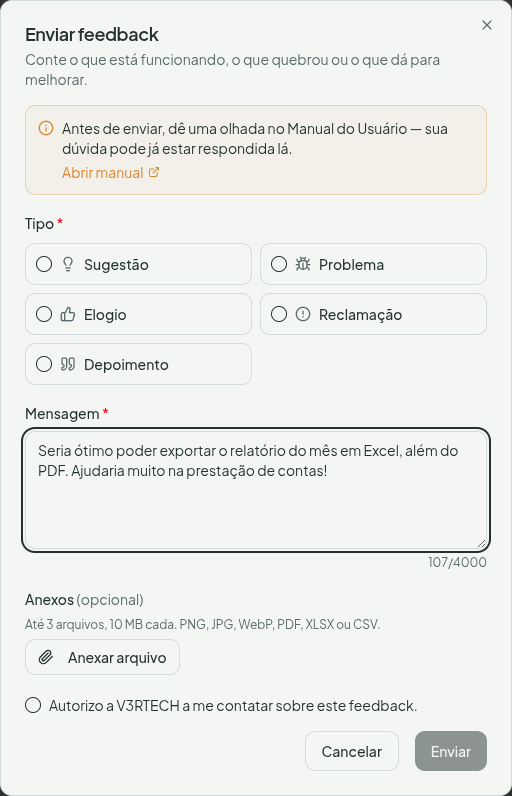

# Enviar feedback

Encontrou um problema, teve uma ideia ou quer elogiar? Você fala direto com a equipe do V3RCondo pelo botão de feedback — sem sair do app.

## Onde fica

Na **barra do topo**, à direita, **ao lado do seu avatar**, clique no **ícone de mensagem (💬)**. Ele aparece em qualquer tela, no computador e no celular.

## Como enviar

1. Clique no **ícone de mensagem (💬)** no topo.
2. Escolha o **tipo** do seu feedback:
   - **Sugestão** — uma ideia ou melhoria
   - **Problema** — algo que não funcionou como esperado
   - **Elogio** — o que você gostou
   - **Reclamação** — algo que incomodou
   - **Depoimento** — um relato sobre a sua experiência com o V3RCondo
3. Escreva a sua **mensagem**.
4. Se ajudar, **anexe arquivos** (até 3, de 10 MB cada) — uma captura de tela, um arquivo que deu erro, uma planilha. Formatos aceitos: imagens, PDF, XLSX e CSV.
5. Se quiser, marque **"Autorizo a V3RTECH a me contatar sobre este feedback"** — assim a equipe pode falar com você caso precise de mais detalhes.
6. Clique em **Enviar**.

## Depoimentos

Se escolher **Depoimento**, aparece uma opção extra para **autorizar a publicação** do seu relato no site do V3RCondo. Marcar é opcional — sem a autorização, seu depoimento é usado apenas internamente.

## Dicas

- Antes de enviar uma dúvida, vale conferir se ela já está respondida neste manual — o próprio formulário traz um atalho para ele.
- Quanto mais detalhes (e, quando fizer sentido, uma captura de tela), mais rápido a equipe entende e resolve.
